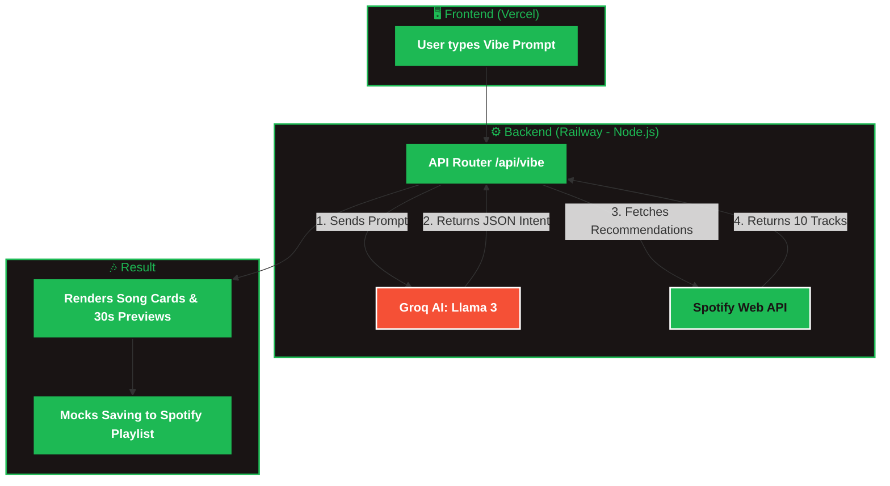

# 🎧 Spotify Vibe
> **An AI-Native Music Discovery MVP**

---

## 🌟 What is Spotify Vibe?

**Spotify Vibe** is a next-generation music discovery platform that allows users to type a natural language description of their current mood, activity, or moment. 

Instead of choosing from pre-defined genres or scrolling through generic "workout" playlists, the AI interprets your exact intent and returns a highly customized, curated Spotify playlist.

**Example Input:** *"focused but restless, like coding at midnight when the deadline is tomorrow"*
**Expected Output:** A perfectly curated 10-track Spotify playlist that captures that semantic context.

---

## 🚀 Key Features

* **Natural Language Intent Extraction:** Uses Groq (Llama-3.3-70b-versatile) to extract structured JSON (mood, energy, valence, genres, tempo) from your casual description.
* **Smart Audio Feature Filtering:** Dynamically maps intent to the Spotify Web API using precise audio characteristics like energy, valence, and tempo.
* **Instant Playlist Generation (Mock):** Click a button to save your exact vibe directly to your Spotify library. *(Note: Currently showing a mock of adding recommendations to playlists and favorites due to Spotify API limitations).*
* **Stateless & Secure:** No database required. Fully relies on zero-storage stateless execution with Spotify OAuth.

---

## 🏗️ System Architecture

Our solution bridges the gap between AI and the Spotify ecosystem through a seamless 3-layer architecture:

---

## 🛠️ Technology Stack

| Layer | Technologies Used |
| :--- | :--- |
| **Frontend UI** | HTML5, CSS3, Vanilla JavaScript, Vercel |
| **Backend API** | Node.js, Express, Railway |
| **AI Intelligence** | Groq API (llama-3.3-70b-versatile) |
| **Music Ecosystem** | Spotify Web API, Spotify OAuth 2.0 |

---

## 🔒 Security & Performance

* **Zero User Data Stored:** The architecture is fully stateless. We don't save your prompts, music tastes, or account details.
* **Environment Isolation:** API keys and Secrets are kept securely in Railway environment variables.
* **Graceful Fallbacks:** If the AI interprets an intent vaguely, it will fall back to safe, neutral musical parameters to guarantee a smooth user experience.
