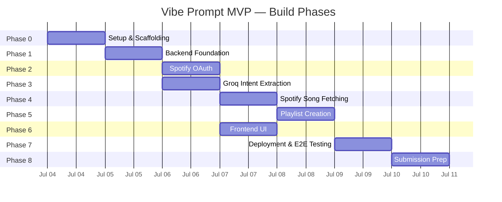
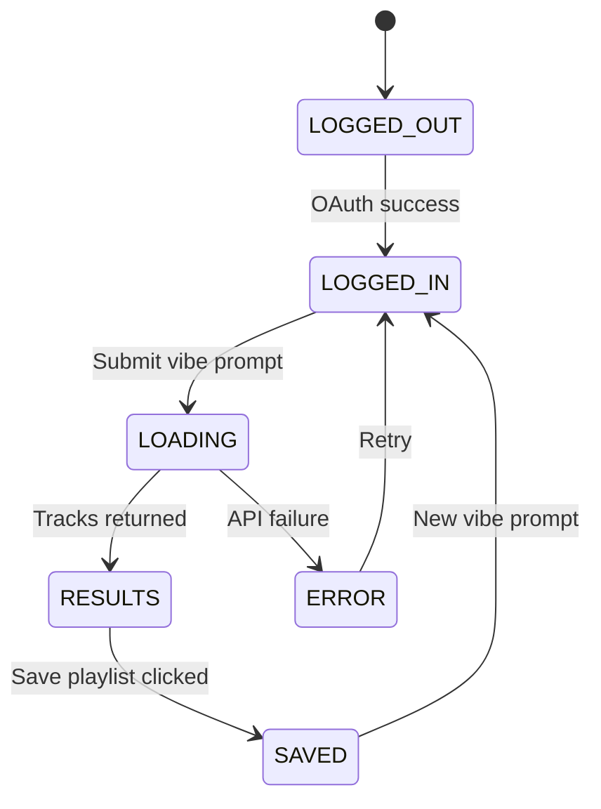
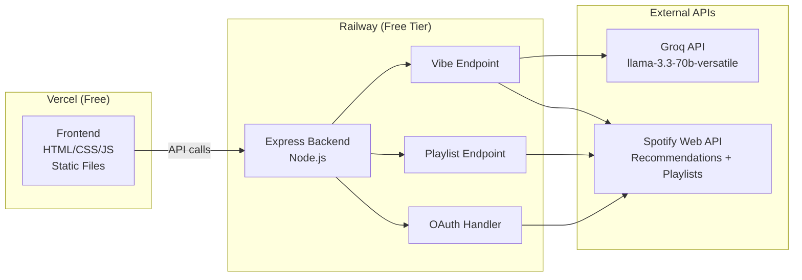

# Implementation Plan: Vibe Prompt
## Phase-wise Build Guide — NextLeap PM Fellowship MVP (Part 4)

> **Scope:** End-to-end build plan for the AI-Native MVP
>
> **Reference:** [Architecture](architecture.md) · [Problem Statement](problem_statement.md) · [Decisions](Docs/decisions.md)
>
> **Deadline:** July 6, 2026, 3:59 PM IST

---

## Overview

**Stack:** Node.js + Express (Railway) + HTML/JS (Vercel) + Groq API + Spotify Web API
**Goal:** A live, deployed, end-to-end working MVP accessible via public URL
**Cost:** $0 (all services on free tiers)

---

## Timeline



> **Note:** Phases 2 and 3 can run in parallel since OAuth and Groq integration are independent. Phase 6 depends on Phase 2 (OAuth flow) but can begin frontend scaffolding early.

---

## Folder Structure (Phase-Mapped)

Each component lives in its designated folder. The structure aligns with the phased build approach used across all projects in this workspace (see [graduation project structure](file:///c:/Project/graduation%20project/Docs/implementation_plan.md)).

```
vibe-prompt/
├── Docs/
│   └── decisions.md              # Architectural & business decisions log
│
├── frontend/                      # Phase 6 — UI layer
│   ├── index.html
│   ├── style.css
│   ├── app.js
│   └── callback.html
│
├── backend/                       # Phases 1–5 — Server & API layer
│   ├── server.js                  # Phase 1 — Express entry point
│   ├── routes/
│   │   ├── auth.js                # Phase 2 — Spotify OAuth
│   │   ├── vibe.js                # Phase 4 — Vibe prompt endpoint
│   │   └── playlist.js            # Phase 5 — Playlist creation endpoint
│   ├── services/
│   │   ├── groq.js                # Phase 3 — LLM intent extraction
│   │   └── spotify.js             # Phase 4 & 5 — Spotify API integration
│   ├── middleware/
│   │   └── errorHandler.js        # Centralized error handling
│   ├── .env
│   ├── .env.example
│   └── package.json
│
├── tests/                         # Evaluation scripts (per-phase TDD)
│   ├── test_groq.js               # Phase 3 — Groq output validation
│   ├── test_spotify.js            # Phase 4 — Track fetch validation
│   └── test_e2e.js                # Phase 7 — End-to-end flow validation
│
├── architecture.md
├── problem_statement.md
├── implementation_plan.md          # ← This document
├── .gitignore
└── README.md
```

---

## Phase 0: Setup (Do This First)

**Goal:** Scaffold the project, install dependencies, configure environment variables.

### Tasks

| # | Task | Details |
|---|------|---------|
| 0.1 | Create project directory structure | All folders as shown above |
| 0.2 | `.gitignore` | `node_modules/`, `.env`, `*.env.local`, `.DS_Store` |
| 0.3 | `.env.example` | Template with all required keys (no real values) |
| 0.4 | Backend `package.json` | `npm init -y` in `backend/` |
| 0.5 | Install dependencies | `express`, `axios`, `dotenv`, `cors` |

### .gitignore (Critical — Do Not Skip)
```
node_modules/
.env
*.env.local
.DS_Store
```

### Environment Variables Setup

**Backend .env file (Railway):**
```
GROQ_API_KEY=your_groq_api_key_here
SPOTIFY_CLIENT_ID=your_spotify_client_id_here
SPOTIFY_CLIENT_SECRET=your_spotify_client_secret_here
SPOTIFY_REDIRECT_URI=https://your-vercel-app.vercel.app/callback.html
PORT=3000
FRONTEND_URL=https://your-vercel-app.vercel.app
```

**Frontend configuration (hardcoded in app.js for vanilla HTML/JS — no build tool):**
```javascript
// app.js — top of file
const CONFIG = {
  BACKEND_URL: 'https://your-railway-app.railway.app',
  SPOTIFY_CLIENT_ID: 'your_spotify_client_id_here',
  SPOTIFY_REDIRECT_URI: 'https://your-vercel-app.vercel.app/callback.html'
};
```

> **Decision:** No Vite or build tooling for the frontend. The stack is vanilla HTML/CSS/JS deployed as static files on Vercel. Environment variables for the frontend are hardcoded constants in `app.js` since the Client ID is a public value (not a secret). See [Decisions](Docs/decisions.md) for rationale.

### Exit Criteria
- [ ] All folders exist as specified
- [ ] `npm install` completes cleanly in `backend/`
- [ ] `.env.example` contains all 6 required keys
- [ ] `.gitignore` prevents `node_modules/` and `.env` from being tracked

---

## Phase 1: Backend Foundation

**Goal:** A working Express server deployed on Railway that can receive requests and respond correctly.

### Tasks

| # | Task | Details |
|---|------|---------|
| 1.1 | Initialize Node project | `cd backend && npm init -y && npm install express axios dotenv cors` |
| 1.2 | Build `server.js` | Express app with CORS, route mounting, health check |
| 1.3 | Build error handler middleware | Centralized error handling — no raw stack traces to frontend |
| 1.4 | Deploy to Railway | Push → connect → set env vars → verify health check |

**`server.js` Requirements:**
- Load environment variables from `.env`
- Enable CORS for the Vercel frontend URL only
- Mount route files: `/api/auth`, `/api/vibe`, `/api/playlist`
- Listen on `process.env.PORT`
- `GET /` health check returns `{status: "ok"}`
- Centralized error handler — all errors return JSON, never raw stack traces

### Exit Criteria
- [ ] Railway app is live
- [ ] `GET https://your-railway-app.railway.app/` returns `{status: "ok"}`
- [ ] No environment variables are hardcoded in source code
- [ ] Error handler returns structured JSON for all error types

---

## Phase 2: Spotify OAuth

**Goal:** User can log in with their Spotify account and the backend can make authenticated API calls on their behalf.

### Tasks

| # | Task | Details |
|---|------|---------|
| 2.1 | Build auth route (`backend/routes/auth.js`) | Login + callback endpoints |
| 2.2 | Build `callback.html` (frontend) | Receives auth code, exchanges for token |
| 2.3 | Update Spotify Developer Dashboard | Add Vercel callback URL to Redirect URIs |

**Auth Route Endpoints:**

`GET /api/auth/login`
- Constructs Spotify OAuth URL with scopes: `playlist-modify-public`, `playlist-modify-private`, `user-read-private`, `user-read-email`
- Redirects user to Spotify authorization page

`GET /api/auth/callback`
- Receives auth code from Spotify redirect
- Exchanges auth code for access token + refresh token using Spotify token endpoint
- Returns access token to frontend

**Spotify Token Exchange:**
```
POST https://accounts.spotify.com/api/token
Headers: Authorization: Basic base64(CLIENT_ID:CLIENT_SECRET)
Body: grant_type=authorization_code, code=AUTH_CODE, redirect_uri=REDIRECT_URI
```

**`callback.html` Logic:**
- Reads the auth code from URL query params
- Sends it to backend `/api/auth/callback`
- Stores the returned access token in `sessionStorage`
- Redirects user back to `index.html`

### Exit Criteria
- [ ] User clicks Login → redirected to Spotify
- [ ] User approves → redirected back to app
- [ ] Access token is stored in `sessionStorage`
- [ ] No client secret is exposed in frontend code
- [ ] Token exchange works on both local and deployed environments

---

## Phase 3: Groq Intent Extraction

**Goal:** Backend receives a vibe prompt and returns structured JSON extracted by Groq.

### Tasks

| # | Task | Details |
|---|------|---------|
| 3.1 | Build Groq service (`backend/services/groq.js`) | `extractIntent(prompt)` function |
| 3.2 | Build test script (`tests/test_groq.js`) | Validate 5 sample prompts |
| 3.3 | Implement failure fallback | Retry once → safe defaults on second failure |

**`extractIntent(prompt)` Requirements:**

- Sends the user's prompt to Groq API using `llama-3.3-70b-versatile` model
- System prompt:

```
You are a music curator AI. Extract structured listening intent from the user's vibe description.
Return ONLY valid JSON with no explanation, no markdown, no preamble:
{
  "mood": "one word string",
  "energy": "number 0.0 to 1.0",
  "valence": "number 0.0 to 1.0",
  "genres": ["2-3 valid Spotify genre seed strings"],
  "tempo": "slow or medium or fast",
  "search_keywords": ["3 keyword strings for Spotify search"]
}
If the prompt is vague: default energy 0.5, valence 0.5, mood neutral.
Always return valid JSON only.
```

- Parses the JSON response
- If parsing fails: retries once with a stricter prompt
- If retry fails: returns safe defaults `{mood: "neutral", energy: 0.5, valence: 0.5, genres: ["pop"], tempo: "medium", search_keywords: ["music"]}`

### Test Prompts (Validation Suite)

Test the Groq service with these 5 prompts before connecting to Spotify:

| # | Prompt | Expected Traits |
|---|--------|-----------------|
| 1 | "late night drive, melancholic but calm" | Low energy, low valence |
| 2 | "focused but restless, coding at midnight" | Medium energy, low valence |
| 3 | "sunday morning, slow and warm" | Low energy, high valence |
| 4 | "pre-workout, high energy, aggressive" | High energy, low-medium valence |
| 5 | "heartbroken but trying to be okay" | Low energy, mixed valence |

### Exit Criteria
- [ ] All 5 test prompts return valid JSON
- [ ] No plain text responses from Groq
- [ ] Failure fallback returns safe defaults without crashing
- [ ] Response time < 5 seconds per prompt
- [ ] `test_groq.js` passes all assertions

---

## Phase 4: Spotify Song Fetching

**Goal:** Backend uses Groq output to fetch 10 matching tracks from Spotify.

### Tasks

| # | Task | Details |
|---|------|---------|
| 4.1 | Build Spotify service (`backend/services/spotify.js`) | `fetchTracks(intentJSON, accessToken)` function |
| 4.2 | Build vibe route (`backend/routes/vibe.js`) | `POST /api/vibe` endpoint |
| 4.3 | Build test script (`tests/test_spotify.js`) | Validate track response shape |

**`fetchTracks(intentJSON, accessToken)` Requirements:**

Calls Spotify Recommendations endpoint:
```
GET https://api.spotify.com/v1/recommendations
Headers: Authorization: Bearer ACCESS_TOKEN
Params:
  seed_genres: intentJSON.genres[0], intentJSON.genres[1]
  target_energy: intentJSON.energy
  target_valence: intentJSON.valence
  min_energy: intentJSON.energy - 0.2 (floor at 0)
  max_energy: intentJSON.energy + 0.2 (ceiling at 1)
  limit: 10
```

Returns array of 10 track objects, each containing:
- `track.id`
- `track.name`
- `track.artists[0].name`
- `track.album.images[0].url` (album art)
- `track.preview_url` (30-sec preview — filter out nulls)
- `track.external_urls.spotify` (link to open in Spotify)
- `track.uri` (for playlist creation)

**`POST /api/vibe` Endpoint:**
- Receives `{prompt, accessToken}` from frontend
- Calls `extractIntent(prompt)` → gets `intentJSON`
- Calls `fetchTracks(intentJSON, accessToken)` → gets `tracks`
- Returns `{intent: intentJSON, tracks: tracksArray}` to frontend

### Exit Criteria
- [ ] `POST /api/vibe` with a prompt and valid access token returns 10 tracks
- [ ] Each track has name, artist, album art URL, Spotify link, URI
- [ ] Tracks without preview URLs are filtered out and replaced
- [ ] `test_spotify.js` validates response shape

---

## Phase 5: Playlist Creation

**Goal:** User can save the 10 returned tracks as a named Spotify playlist in one click.

### Tasks

| # | Task | Details |
|---|------|---------|
| 5.1 | Add playlist creation to Spotify service | `createPlaylist(trackURIs, playlistName, accessToken)` function |
| 5.2 | Build playlist route (`backend/routes/playlist.js`) | `POST /api/playlist` endpoint |

**`createPlaylist(trackURIs, playlistName, accessToken)` Flow:**

1. Get the current user's Spotify ID:
```
GET https://api.spotify.com/v1/me
Headers: Authorization: Bearer ACCESS_TOKEN
```

2. Create a new playlist:
```
POST https://api.spotify.com/v1/users/{user_id}/playlists
Body: {name: playlistName, public: false, description: "Created by Vibe Prompt"}
```

3. Add tracks to the playlist:
```
POST https://api.spotify.com/v1/playlists/{playlist_id}/tracks
Body: {uris: trackURIs}
```

4. Return the playlist URL for the frontend to display

**`POST /api/playlist` Endpoint:**

Receives:
- `{trackURIs: [], playlistName: string, accessToken: string}`

Returns:
- `{playlistUrl: string, playlistId: string}`

### Exit Criteria
- [ ] Clicking "Save as Playlist" creates a real playlist in the user's Spotify account
- [ ] Playlist is named after the user's vibe prompt
- [ ] All tracks are added correctly (verify count matches)
- [ ] Playlist URL returned to frontend is valid and opens in Spotify

---

## Phase 6: Frontend UI

**Goal:** A clean, minimal, mobile-responsive interface that handles the full user flow.

### Tasks

| # | Task | Details |
|---|------|---------|
| 6.1 | Build `index.html` structure | Header, vibe input, loading, results, save CTA |
| 6.2 | Build `style.css` | Dark theme, Spotify-inspired, glassmorphism cards |
| 6.3 | Build `app.js` logic | State management, API calls, rendering |
| 6.4 | Build song cards | Album art, track name, artist, preview, Spotify link |

**UI Sections (in order):**
1. Header with logo and "Login with Spotify" button
2. Vibe input section (only shown after login)
3. Loading state (shown while API processes)
4. Results section — 10 song cards
5. Save playlist CTA

**State Machine:**



**Song Card Components:**
- Album art (square image)
- Track name
- Artist name
- Play button (triggers 30-second audio preview)
- Spotify icon linking to full track

**Design Requirements:**

| Property | Value |
|----------|-------|
| Background | `#121212` (Spotify dark) |
| Accent | `#1DB954` (Spotify green) |
| Font | Inter or system-ui |
| Card style | Glassmorphism — `rgba(255,255,255,0.05)` background, subtle blur |
| Input placeholder | "Describe your vibe... (eg: focused but restless, rainy day coding)" |
| Button text | "Find My Vibe" |
| Layout | Mobile responsive — single column on small screens |
| Min font size | 14px |
| Micro-animations | Fade-in on card render, hover scale on cards, smooth loading pulse |

### Exit Criteria
- [ ] Full user flow works end-to-end in browser
- [ ] Loading state visible during API calls (minimum 200ms to prevent flash)
- [ ] Song previews play correctly (with pause/play toggle)
- [ ] "Save as Playlist" creates playlist and shows confirmation with link
- [ ] Responsive layout works on mobile (≤ 480px) and desktop
- [ ] No broken layouts, readable text, professional appearance

---

## Phase 7: Deployment & E2E Testing

**Goal:** Both frontend and backend are live on public URLs. End-to-end flow works on deployed version.

### Deployment Architecture



### Tasks

| # | Task | Details |
|---|------|---------|
| 7.1 | Deploy Backend to Railway | Push → connect GitHub → set env vars → verify health check |
| 7.2 | Deploy Frontend to Vercel | Push → connect GitHub → set root to `/frontend` → copy URL |
| 7.3 | Update all URLs | Railway env vars, Vercel config, Spotify Developer Dashboard |
| 7.4 | End-to-end test on deployed version | Full 9-step flow test |
| 7.5 | Cross-browser/device validation | Test on Chrome, Safari, mobile |

**Step 7.1 — Deploy Backend to Railway**
1. Push `backend/` to GitHub
2. Create new Railway project → connect GitHub repo
3. Set root directory to `/backend`
4. Add all environment variables in Railway dashboard
5. Railway auto-deploys on push
6. Copy Railway public URL

**Step 7.2 — Deploy Frontend to Vercel**
1. Push `frontend/` to GitHub (can be same repo, different folder)
2. Create new Vercel project → connect GitHub repo
3. Set root directory to `/frontend`
4. Copy Vercel public URL

**Step 7.3 — Update All URLs**
- Update `SPOTIFY_REDIRECT_URI` in Railway env vars to Vercel callback URL
- Update `FRONTEND_URL` in Railway env vars to Vercel URL
- Update Redirect URI in Spotify Developer Dashboard to Vercel callback URL
- Update `CONFIG.BACKEND_URL` in `app.js` to Railway URL

**Step 7.4 — End-to-End Test (Exact Flow)**

| Step | Action | Expected Result |
|------|--------|-----------------|
| 1 | Open Vercel URL | Login button visible |
| 2 | Click Login | Spotify OAuth opens |
| 3 | Approve | Redirected back to app, vibe input appears |
| 4 | Type vibe prompt | Text entered in input field |
| 5 | Click "Find My Vibe" | Loading state appears |
| 6 | Wait for response | 10 song cards appear with album art |
| 7 | Click play on a card | 30-second preview plays |
| 8 | Click "Save as Playlist" | Playlist created in Spotify |
| 9 | Open Spotify | Verify playlist exists with all tracks |

### Exit Criteria
- [ ] Live URL accessible by anyone without running any local server
- [ ] Full flow works end-to-end on deployed version
- [ ] Spotify playlist creation confirmed working
- [ ] No CORS errors in browser console
- [ ] OAuth callback redirects correctly on deployed URL
- [ ] Railway cold start completes within 30 seconds
- [ ] `test_e2e.js` passes all assertions on deployed URLs

---

## Phase 8: Submission Prep

### 8.1 Final Checklist

**Review Engine (Part 1):**
- [ ] Dashboard deployed on live URL
- [ ] Dashboard link accessible without login
- [ ] Screenshot ready for deck slide

**MVP (Part 4 — Vibe Prompt):**
- [ ] Vibe Prompt deployed on live URL
- [ ] End-to-end flow tested and working
- [ ] Link ready for submission

**Deck (10 slides):**
- [ ] All slides complete
- [ ] Review Engine workflow on one slide
- [ ] MVP demo link embedded in deck
- [ ] Survey link accessible to evaluator
- [ ] No name on any slide
- [ ] Font size minimum 14px adhered to
- [ ] File size under 40MB
- [ ] File named: NL Spotify

**Submission:**
- [ ] PDF deck uploaded
- [ ] Review Engine live link submitted
- [ ] MVP live link submitted
- [ ] All shared links set to public access

---

## Risk Register

| Risk | Likelihood | Impact | Mitigation |
|------|------------|--------|------------|
| Spotify OAuth breaks on deployment | Medium | High | Test callback URL immediately after Vercel deploy; have redirect URI ready |
| Groq rate limit during evaluation demo | Low | High | Add retry logic with exponential backoff; show clear loading state |
| Groq returns invalid JSON | Medium | Medium | Retry once with stricter prompt; return safe defaults on second failure |
| Railway cold start causes 30s delay | High | Medium | Keep service warm with scheduled health check ping; show loading animation |
| Spotify preview URLs are null | Medium | Low | Filter nulls before returning to frontend; fetch additional tracks if needed |
| Spotify Recommendations API returns < 10 tracks | Low | Medium | Accept partial results; display available tracks with message |
| Evaluator cannot access deployed links | Low | Critical | Test all links from incognito window, different device, and mobile |
| CORS errors on deployed version | Medium | High | Verify `FRONTEND_URL` env var matches exact Vercel domain (no trailing slash) |
| Token expiry during demo | Medium | Medium | Handle 401 errors gracefully; prompt re-login with clear message |

---

## Appendix: Tech Stack Summary

| Layer | Tool | Purpose | Cost |
|-------|------|---------|------|
| Frontend | HTML, CSS, Vanilla JavaScript | Single page user interface | Free |
| Backend | Node.js + Express | API routing, server-side logic | Free |
| LLM | Groq API (llama-3.3-70b-versatile) | Natural language intent extraction | Free tier |
| Music API | Spotify Web API | Song search, playlist creation | Free |
| Frontend Deployment | Vercel | Static frontend hosting | Free |
| Backend Deployment | Railway | Node.js backend hosting | Free tier |
| Auth | Spotify OAuth 2.0 | User authentication and API access | Free |
