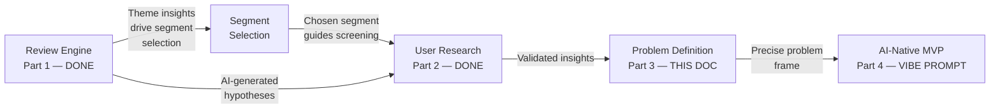

# Problem Statement: Vibe Prompt
## Spotify AI-Native Music Discovery MVP — NextLeap PM Fellowship Graduation Project (Part 4)

> **Scope:** This document covers the problem definition and research backing for the **AI-Native MVP** (Part 4 of the graduation project). It builds on insights from [Part 1: Review Engine](file:///c:/Project/graduation%20project/Docs/architecture.md), primary user research (Part 2), and root cause analysis (Part 3).
>
> **Reference:** [Architecture](architecture.md) · [Implementation Plan](implementation_plan.md) · [Decisions](Docs/decisions.md)
>
> **Deadline:** July 6, 2026, 3:59 PM IST

---

## 1. Target Segment

**Segment Name:** Contextual Listeners

**Definition:**
Spotify users who listen daily or weekly and want to discover new music matched to their current mood, activity, or moment — but default to repetitive listening because expressing context within Spotify requires too much effort.

**Behavioral Profile:**
- Open Spotify with a specific listening intent (a mood, activity, or moment)
- Cannot find music that matches that intent without manual effort
- Default to familiar playlists out of comfort, not preference
- Seek discovery externally — primarily YouTube — when Spotify fails them
- Return to Spotify for playback after discovering music elsewhere

**Evidence:**
- Primary Research: 10 screener-qualified research participants, recruited from 25 screener respondents based on three behavioral criteria: (1) active Spotify usage, (2) 5–15+ hours of weekly listening, (3) demonstrated external discovery behavior (YouTube, TikTok, Instagram). Participants completed a structured open-ended follow-up research instrument. (Confidence: Medium — directional, not statistically significant)
- 10/10 participants confirmed repetitive listening as default behavior
- 7/10 participants switch to YouTube when Spotify recommendations fail
- 4/10 participants explicitly cited mood and activity-based discovery as an unmet need
- Secondary Research: AI Review Engine analysis of 359 reviews from Reddit r/Spotify — Algorithm Accuracy is the highest volume complaint theme (128 mentions out of 359)

**Screener Methodology:**
- Total screener respondents: 25
- Qualified and recruited: 10 (those who use Spotify actively, listen 5–15+ hours/week, already go outside Spotify for discovery, and agreed to participate)
- Disqualified: 15 (Apple Music/YouTube Music primary users, casual listeners under 5 hours/week, or those who never experience repetitive listening)
- This recruitment approach confirms participants represent the Contextual Listener behavioral segment, not a random sample.

**Confidence Level:** Medium. Sample size is small. However, screener qualification significantly reduces selection bias compared to open recruitment. Findings are directional and consistent with Review Engine data.

---

## 2. Root Cause Analysis — 5 Whys

| Level | Question | Answer |
|-------|----------|--------|
| Why 1 | Why do users repeat the same songs? | Discovery feels risky and effortful compared to comfort of familiar music |
| Why 2 | Why does discovery feel effortful? | There is no way to express current intent or context inside the app |
| Why 3 | Why can't users express context? | User input is binary — skip or save. No mood, activity, or moment signal is captured |
| Why 4 | Why is input so limited? | The algorithm is optimized for session retention, not taste expansion |
| Why 5 (Root Cause) | Why is the algorithm built this way? | **Spotify's algorithm has no intent layer — it knows what you played, not why you played it** |

**Label:** Hypothesis — supported by survey data and Review Engine findings. Requires Spotify internal data to fully validate.

---

## 3. Problem Statement

### Problem
Spotify users who want context-specific music discovery — matched to their current mood, activity, or moment — cannot do so within the app without significant manual effort, causing them to default to repetitive listening or abandon Spotify entirely for YouTube.

### Background
- Primary research: 10 screener-qualified participants recruited from 25 screener respondents based on active Spotify usage, listening frequency, and external discovery behavior
- 10/10 participants confirmed repetitive listening as default behavior
- 7/10 participants switch to YouTube when Spotify's recommendations fail them
- 4/10 participants explicitly cited mood and activity-based discovery as an unmet need
- Secondary research: Review Engine analysis of 359 reviews confirms Algorithm Accuracy as the highest volume complaint theme with 128 mentions
- Top data source: Reddit r/Spotify (42% of volume analyzed)

### Relevance
Every session where a user leaves Spotify for YouTube is a session Spotify did not monetize. Repetitive listening stagnates the algorithm, weakens personalization over time, and reduces new track saves — all direct signals Spotify's growth team tracks for retention health.

The problem directly conflicts with Spotify's stated strategic goal: increase meaningful music discovery and reduce repetitive listening behavior.

### Root Cause
The algorithm optimizes for what you have played historically. It has no mechanism to understand why you are listening right now. This creates a structural mismatch between algorithmic output and the user's real-time intent.

---

## 4. Why Traditional Solutions Fail

### What Traditional Systems Do
- Match songs against fixed taxonomies (genre, BPM, mood tags)
- Require explicit user input — user must know and state what they want
- Learn from historical behavior, not current intent
- Offer pre-built mood buckets: Focus, Workout, Sleep, Party

### Why They Fail the Contextual Listener
A fixed mood selector cannot understand: *"something that feels like driving alone at 2am"*

There is no genre tag for that. No pre-built playlist. No BPM range. A traditional system returns something generic or nothing at all.

Traditional systems match against categories. They cannot parse open-ended human intent.

### Why AI Is Necessary
AI uniquely solves this by:
1. **Semantic understanding** — converts natural language vibe descriptions into vector embeddings that map to audio characteristics (energy, valence, tempo, danceability)
2. **Implicit intent inference** — understands meaning, not just keywords
3. **Zero-effort context capture** — user expresses intent in their own language without selecting from pre-defined options
4. **Dynamic recalibration** — can handle novel, never-before-seen vibe descriptions without requiring a new taxonomy entry

**The 10x argument:** A traditional filter system requires the user to know the category. AI requires only that the user knows the feeling.

---

## 5. Business Case

| Signal | Data Source | Business Impact |
|--------|-------------|-----------------|
| YouTube fallback behavior | 7/10 survey respondents | Session abandonment — lost ad revenue, lost engagement depth |
| Repetitive listening | 10/10 survey respondents | Algorithmic stagnation — weaker personalization over time |
| Unmet mood/context need | 4/10 survey respondents | Unresolved friction — churn risk for high-engagement users |
| Algorithm Accuracy complaints | 128/359 reviews (Review Engine) | Highest volume pain point across all themes analyzed |

**Strategic alignment:** Directly maps to Spotify's stated goal of increasing meaningful music discovery and reducing repetitive listening behavior.

**Core business case in one line:**
Every session where a user goes to YouTube for discovery is a session Spotify did not monetize — and a discovery habit loop it did not reinforce.

---

## 6. Hypothesis

> If Spotify introduces an AI-powered intent layer that converts natural language vibe descriptions into curated playlists — without requiring users to select from pre-defined mood categories — then Contextual Listeners will discover and save more new music per session, measured by a 20% increase in new track saves within 90 days of feature rollout.

### 5 Hypothesis Elements Confirmed

| Element | Value |
|---------|-------|
| Specific Change | AI intent layer converting natural language to curated playlists |
| Expected Impact | Increased new track saves per session |
| Target User | Contextual Listeners — daily/weekly users with unmet discovery intent |
| Measurable Metric | 20% increase in new track saves |
| Timeframe | 90 days post-rollout |

---

## 7. MVP Evaluation Criteria

The solution will be evaluated at three levels:

| Level | Criteria | Question |
|-------|----------|----------|
| **L1: Problem-Solution Fit** | Does the solution address the identified problem? | Is there a clear, logical connection between the research-backed problem and the proposed solution? |
| **L2: Differentiation** | Is the solution differentiated from what exists? | Does this solution do something that Spotify's current features and competitors' products do not? |
| **L3: Competitive Advantage** | Is there a defensible moat? | Is this solution difficult for a competitor to replicate overnight? What makes it uniquely sustainable? |

### What This MVP Must Demonstrate

- Why traditional recommendation systems (collaborative filtering, content-based) are insufficient for this specific problem
- What AI (LLMs, semantic intent parsing, contextual reasoning) unlocks that was previously difficult or impossible
- How AI fundamentally changes the user experience of music discovery — not just incrementally improves it

### Prototype Quality Standards

- Brand-aligned visual design (Spotify's design language — dark theme, green accent `#1DB954`)
- Clear, polished copy — not AI-generated boilerplate
- Thoughtful UX that demonstrates iteration and user-centricity
- Functional interactions that communicate the core value proposition

---

## 8. Success Metrics

### Product Metrics (Post-Launch Targets)

| Metric | What It Measures |
|--------|------------------|
| **New Track Save Rate** | % of returned tracks that users save to their library or playlist |
| **Playlist Creation Rate** | % of vibe prompt sessions that result in a saved playlist |
| **Session Depth** | Average number of vibe prompts per user session |
| **Return Usage** | % of users who return to use Vibe Prompt within 7 days |
| **YouTube Fallback Reduction** | Self-reported reduction in external discovery behavior |

### AI Evaluation Metrics

| Metric | What It Measures |
|--------|------------------|
| **Intent Alignment Accuracy** | % of sessions where returned tracks match the described vibe |
| **Groq Parse Success Rate** | % of prompts where Groq returns valid, parseable JSON on first attempt |
| **Recommendation Relevance** | User-rated relevance of tracks (1–5 scale, if feedback is collected) |
| **Zero-Result Rate** | % of prompts that fail to return any matching tracks |

---

## 9. Connection to Graduation Project Parts 1–3

The Review Engine (Part 1) surfaced "Algorithm Accuracy" as the #1 complaint theme (128/359 reviews). User research (Part 2) validated that 7/10 contextual listeners abandon Spotify for YouTube when discovery fails. This problem statement (Part 3) frames the root cause as a missing intent layer. Vibe Prompt (Part 4) is the AI-native solution that directly addresses this root cause.

---

## 10. What This Problem Statement Does NOT Claim

- This is not a statistically significant study. Sample size is 10.
- The MoM metrics shown in the Review Engine dashboard are directional signals, not validated time-series data.
- "Contextual Listener" is a behavioral segment hypothesis, not a validated Spotify internal segment.
- The 20% metric is a directional target, not a forecasted outcome.

All claims above are labeled by confidence level and should be presented as such in the final deck.

---

## 11. Key Constraints

| Constraint | Details |
|------------|---------|
| **Public Data Only** | Review scraping must use publicly accessible sources — no login-walled or private API data |
| **Zero PII Leakage** | No user names, email addresses, device identifiers, or account details in any output |
| **Slide Deck** | 10-slide maximum, minimum font size 14pt (Google Slides/PPT), descriptive slide titles conveying the key message |
| **Deployment** | MVP must be deployed to production and accessible via a shareable link |
| **Original Thinking** | All analysis, problem framing, and solution rationale must reflect authentic thought — defensible in an interview setting |
| **Submission Deadline** | July 6, 2026, 3:59 PM IST — no extensions |
